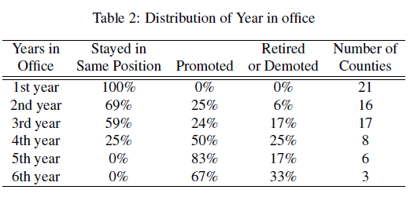

```{r setup, include=FALSE}
knitr::opts_chunk$set(echo = TRUE)
knitr::write_bib(c("blei", "cai", "horsley", "jiang", "un", "seifert", "pan"), "Bibliography.bib", width = 60)
library(tidyverse)
library(stargazer)
library(tinytex)
library(gtable)
library(gt)
```

# Footnote with repo link

All analysis for this paper and the processed data is available on my Github repo.
^[https://github.com/Alex1005-stack/Gov_1006_final_project]


# A graphic:

```{r graphic, echo = FALSE}
# Replicating Figure 3 on page 16 of the paper 

# Loading in statistical analysis estimating the competence/benevolence level and lower and upper boundaries based on how many years an official has been in office 
# readme_out_yroff.csv: estimated proportion of posts for competence and benevolence by year in office, where group refers to the year, with 95% confidence intervals in lwr and upr. Generated using Hopkins and King (2010) ReadMe software

yroff <- read.csv("raw-data/readme_out_yroff.csv", header=TRUE)


# Loading in statistical analysis estimating the competence/benevolence level and lower and upper boundaries based on the proximity to tenure

# readme_out_tenure.csv: estimated proportion of posts for competence and benevolence by proximity to leaving office, where group = 1 refers beginning of tenure, group = 2 to middle of tenure, and group = 3 to end of tenure; 95% confidence intervals in lwr and upr. Generated using Hopkins and King (2010) ReadMe software

tenure <- read.csv("raw-data/readme_out_tenure.csv", header=TRUE)


# Defining y axis

yaxtloc <- c(0,.1,.2,.3,.4,.5)


# Labeling y axis

laxtlab <- c("0%", "10%","20%","30%","40%","50%")


# Defining x axis

xaxtloc <- c(0,.2,.4,.6,.8,1)


# Labeling x axis

lxaxtlab <- c("Beginning", "Middle","End")


# Fig 3: Proportion of web pages with content focused on competence   

# Setting the layout parameters in terms of how much they ought to be magnified in comparison to the defaul for the graph as 1,2 

par(mfrow=c(1,2)) 


# Creating a plot containing all x values from 1 to 5 years of office, and the respective estimate values as the dots in the graph, setting the y axis to run from 0 to 50%, setting the size of the dots to 16 and defining the x and y labels, the width a and the size of the ticks on c and y axis and the labels

plot(1:5, yroff[1:5,]$estimate,ylim=c(0,0.5), pch=16,xlab="Year in Office",ylab="% Web Pages for Competence",cex=1.5, cex.axis=1.5, cex.lab=1.5,yaxt="n")
axis(2, at= yaxtloc,labels= laxtlab, cex.axis=1.5)


# Using a loop to add the upper and lower boundaries of width 2 for each of the years in office (1-5)

for(i in 1:5){
	segments(i,yroff[i,]$lwr,i,yroff[i,]$upr, lwd=2)
}


# Creating a plot containing all x values from 1 to 3 proximity to tenure, and the respective estimate values as the dots in the graph, setting the y axis to run from 0 to 50%, setting the size of the dots to 16 and defining the x and y labels, the width a and the size of the ticks on c and y axis and the labels

plot(1:3, tenure[1:3,]$estimate,ylim=c(0,0.5), pch=16,xlab="Proximity to Leaving Office",ylab="% Web Pages for Competence",cex=1.5, cex.axis=1.5, cex.lab=1.5,xaxt="n",xlim=c(0.8,3.2),yaxt="n")
axis(2, at= yaxtloc,labels= laxtlab, cex.axis=1.5)
axis(1,at=c(1,2,3),labels= lxaxtlab,cex.axis=1.5)


# Using a loop to add the upper and lower boundaries of width 2 for each of the proximities to tenure (1-3)

for(i in 1:3){
	segments(i,tenure[i,]$lwr,i,tenure[i,]$upr, lwd=2)
}


```


# Bibliography (and associated references):

The following excerpt is the introducory paragraph of How Chinese Officials Use the Internet to
Construct their Public Image. [@pan] 

Over the past decade, China has launched a number of online government transparency
policy initiatives aimed at improving publicly available information concerning the activities
of lower-tier officials. These initiatives have been praised as innovations that leverage
the power of the Internet to improve governance and transparency [@horsley; @jiang; @un]. Senior leaders within the Chinese Communist Party (CCP) and government regulations have described these efforts as ways to ensure “hard-working and honest government.” [@seifert]

# Overview

The paper analyses how local government officials use the websites they are required to put up to meet the central government’s transparency requirements, to engineer their public image. It concludes that the internet becomes a tool for self-promotion in authoritarian regimes. The analysis demonstrates that the websites tend to highlight the competence (achievements) or the benevolence (concern for citizens) of these county executives which changes based on the tenure of their cycle. The former is more important to officials that are later in their cycle, while the latter is more important to those earlier in the cycle.

The analysis does so by focusing on a random sample of 100 Chinese counties and their websites. They represent 29 Chinese provinces. Based on this sample they estimate the proportion of posts for competence and benevolence by year in office, where group refers to the year, with 95% confidence intervals in lwr and upr. Generated using Hopkins and King (2010) ReadMe software. The authors then conduct a linear regression that regresses a mayor first year or last year binary indicator on  the number of competence metnions on the websites by county which they extend gradually for additional variables in alternative models. The same is then done for benevolence. These variable include: county resources and environmental factors, incentives of county party secretaries, incentives of prefecture party secretary and other prefecture-level characteristics, county executive’s ability, age, and gender, post-treatment variable of whether the county executive was promoted. The authors conclude from the regression that When a county executive is in the last year of office, an additional 15% or so of website content is on average dedicated to claims of competence. Similarly they conclude that When a county executive is in the first year of office, an additional 10% to 15% of website content is on average dedicated to claims of benevolence. Both results are statistically significant at the 0.05 level.

# Appendix

```{r table, echo = FALSE}
county100 <- read.csv("raw-data/countywebsites_sampled100.csv", sep="\t") 

# Table 2: Distribution of Year in Office
# Creating a count table based of the number of counties in which the mayor has been in office for a certain number of years ( 1- 6 years)

distr <- county100 %>%
  group_by(mayor_tenure2) %>%
  summarise(`Number of Counties` = n()) %>%
  drop_na()

prop <- county100 %>%
  group_by(mayor_tenure2, mayor_status) %>%
  summarise(`Number of Counties` = n()) %>%
  drop_na()%>%
  spread(key = mayor_status, value = `Number of Counties`) %>%
  mutate(`in office` = ifelse(is.na(`in office`), 0 , `in office`),
         promotion = ifelse(is.na(promotion), 0 , promotion),
         retired_demoted = ifelse(is.na(retired_demoted), 0 , retired_demoted),
          Total = `in office`+ promotion + retired_demoted,
         `Stayed in Same Position` = round(`in office`/Total,2),
          Promoted = round(promotion/Total,2),
          `Retired or Demoted` = round(retired_demoted/Total,2)) %>%
  select(`Stayed in Same Position`, Promoted, `Retired or Demoted`, mayor_tenure2)
  
table <- bind_cols(prop, distr) %>%
        select (-mayor_tenure21)

gt_table <- 
  table %>%
  gt(
    rowname_col = "mayor_tenure2",
    groupname_col = "group"
  )


gt_table %>% 
  tab_stubhead(label = "Years in Office") %>%
  tab_header(
    title = "Table 2: Distribution of Year in office",
    subtitle = "Based on sample") %>%
  fmt_percent(
    columns = vars("Stayed in Same Position", "Promoted", "Retired or Demoted"),
    decimals = 0) %>%
  cols_align("center")

```




# References